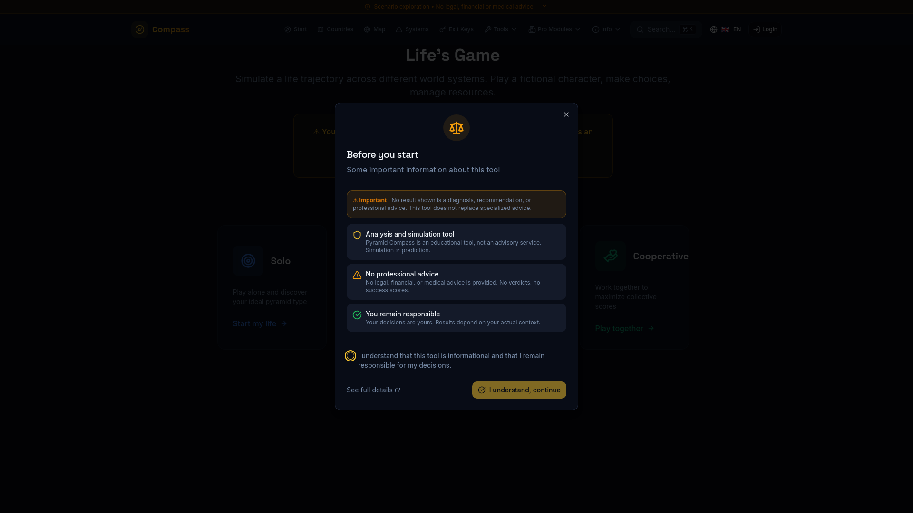

# 🌍 Pyramid Compass — World Alignment Platform

[](https://github.com/system-compass/system-compass/actions)
[](https://www.typescriptlang.org/)
[](https://reactjs.org/)
[](https://lovable.dev/)

> **Plateforme open-source d'aide à la décision** pour comprendre les systèmes-pays, planifier des trajectoires de vie et naviguer la relocalisation internationale.

**🔗 Demo live** : [world-alignment.lovable.app](https://world-alignment.lovable.app)

---

## 📸 Aperçu

<p align="center">
  
  
</p>

<p align="center">
  
  
</p>

---

## 🎯 À propos

Pyramid Compass aide les expatriés, entrepreneurs et institutions à prendre des décisions éclairées concernant la relocalisation internationale. La plateforme analyse 50+ pays selon leurs systèmes socio-économiques et génère des stratégies personnalisées.

### Cibles
- **B2C** : Expatriés, nomades digitaux, familles en relocalisation
- **B2B** : Consultants internationaux, ONG, institutions

---

## ✨ Fonctionnalités principales

| Module | Statut | Description |
|--------|--------|-------------|
| 🌍 **Profils Pays** | ✅ Stable | Analyse de 50+ pays avec données structurées |
| 🔑 **Exit Keys** | ✅ Stable | Stratégies personnalisées selon profil utilisateur |
| 📊 **Dashboard** | ✅ Stable | Suivi de progression avec timelines |
| 🔄 **Comparateur** | ✅ Stable | Comparaison multi-pays côte-à-côte |
| 📄 **Exports PDF** | ✅ Stable | Rapports professionnels exportables |
| 🎮 **Life Game** | 🔄 Beta | Simulation gamifiée tour par tour |
| 🛒 **Marketplace** | 🔄 Beta | Mise en relation avec experts |
| 🏛️ **Governance B2B** | 🔄 Beta | Outils pour institutions |

> Voir [`docs/MODULES-STATUS.md`](./docs/MODULES-STATUS.md) pour le statut détaillé et la roadmap.

---

## 🚀 Démarrage rapide

### Prérequis
- Node.js 20+
- npm ou bun

### Installation

```bash
# Cloner le projet
git clone https://github.com/system-compass/system-compass.git
cd system-compass

# Installation automatique (recommandé)
./scripts/setup-dev.sh

# Ou installation manuelle
npm install
npm run dev
```

> **Note** : L'application fonctionne en mode local avec données mock. Pour le backend complet, utilisez [Lovable Cloud](https://lovable.dev).

📖 Voir [`docs/GETTING-STARTED.md`](./docs/GETTING-STARTED.md) pour les instructions détaillées.

---

## 📁 Documentation

| Document | Description |
|----------|-------------|
| [Getting Started](./docs/GETTING-STARTED.md) | Guide d'installation complet |
| [Contributing](./docs/CONTRIBUTING.md) | Guide de contribution |
| [Testing](./docs/TESTING.md) | Stratégie de tests |
| [API Reference](./docs/API.md) | Documentation des Edge Functions |
| [Architecture](./docs/audit/ARCHITECTURE.md) | Diagrammes et flux de données |
| [Modules Status](./docs/MODULES-STATUS.md) | Statut et roadmap des modules |
| [Audit Reports](./docs/audit/) | Métriques de qualité vérifiables |

---

## 🧪 Tests

```bash
# Exécuter les tests
npm run test

# Avec couverture
npm run test:coverage
```

**Métriques actuelles** (vérifiables via CI) :
- Tests unitaires : 688 passants (100%)
- Couverture estimée : ~78%
- Tables avec RLS : 60+/60+ (sécurité A+)
- Edge Functions : 36 opérationnelles
- Langues supportées : 13 (FR/EN 100%)
- Service layer : 5 modules isolés

📖 Voir [`docs/TESTING.md`](./docs/TESTING.md) pour la stratégie de tests détaillée.

---

## 🛠️ Stack technique

| Couche | Technologie |
|--------|-------------|
| Frontend | React 18, TypeScript, Vite |
| Styling | Tailwind CSS, shadcn/ui |
| Backend | Lovable Cloud (Supabase) |
| Tests | Vitest |
| i18n | react-i18next (FR, EN + 11 langues) |

---

## 🤝 Contribuer

Les contributions sont bienvenues ! Consultez le [guide de contribution](./docs/CONTRIBUTING.md).

```bash
# Workflow rapide
git checkout -b feature/ma-feature
# ... modifications ...
npm run test
npm run lint
git commit -m "feat: description"
git push origin feature/ma-feature
```

### Premiers pas

1. 🐛 Cherchez les [issues "good first issue"](https://github.com/system-compass/system-compass/labels/good%20first%20issue)
2. 💬 Posez vos questions dans les [Discussions](https://github.com/system-compass/system-compass/discussions)
3. 📖 Lisez la [documentation](./docs/)

---

## 📄 Licence

MIT — Voir [LICENSE](./LICENSE)

---

<p align="center">
  <sub>Construit avec ❤️ en utilisant <a href="https://lovable.dev">Lovable</a></sub>
</p>
